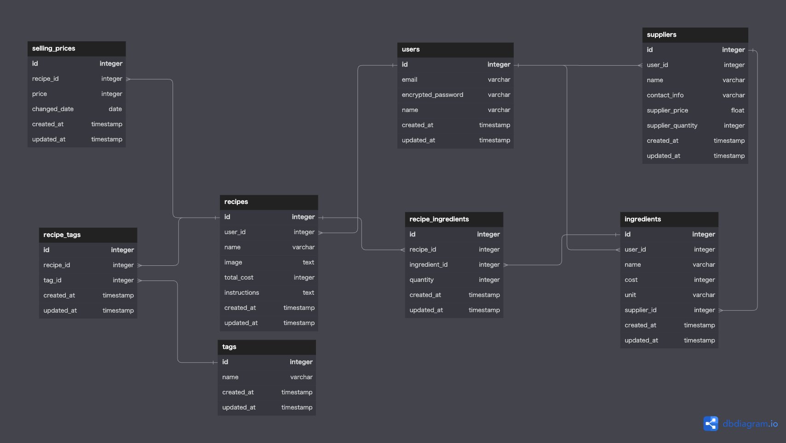

## テーブル定義書

**ユーザーテーブル(users)**

| カラム名         | カラム (英語)      | データ型     | NULL 許容 | キー   | 初期値 | AUTO INCREMENT |
| ---------------- | ------------------ | ------------ | --------- | ------ | ------ | -------------- |
| ID               | id                 | bigint      | 不可      | 主キー |        | Yes            |
| メール           | email              | varchar(255) | 不可      |        |        |                |
| 暗号化パスワード | encrypted_password | varchar(255) | 不可      |        |        |                |
| 名前             | name               | varchar(255) | 不可      |        |        |                |
| 作成日時         | created_at         | timestamp    | 不可      |        |        |                |
| 更新日時         | updated_at         | timestamp    | 不可      |        |        |                |

**レシピテーブル(recipes)**

| カラム名    | カラム (英語) | データ型     | NULL 許容 | キー     | 初期値                       | AUTO INCREMENT |
| ----------- | ------------- | ------------ | --------- | -------- | ---------------------------- | -------------- |
| ID          | id            | bigint      | 不可      | 主キー   |                              | Yes            |
| ユーザー ID | user_id       | bigint       | 不可      | 外部キー |                              |                |
| レシピ名    | name          | varchar(255) | 不可      |          |                              |                |
| 合計原価    | total_cost    | decimal      | 不可      |          |                              |                |
| 手順        | instructions  | text         | 可        |          | レシピの手順はまだありません |                |
| 作成日時    | created_at    | timestamp    | 不可      |          |                              |                |
| 更新日時    | updated_at    | timestamp    | 不可      |          |                              |                |

**原材料テーブル(ingredients)**

| カラム名    | カラム (英語) | データ型     | NULL 許容 | キー     | 初期値 | AUTO INCREMENT |
| ----------- | ------------- | ------------ | --------- | -------- | ------ | -------------- |
| ID          | id            | bigint      | 不可      | 主キー   |        | Yes            |
| ユーザー ID | user_id       | bigint       | 不可      | 外部キー |        |                |
| 仕入れ先 ID | supplier_id   | bigint       | 不可      | 外部キー |        |                |
| 原価        | cost          | decimal      | 不可      |          |        |                |
| 単位        | unit          | varchar(255) | 不可      |          |        |                |
| 原材料名    | name          | varchar(255) | 不可      |          |        |                |
| 作成日時    | created_at    | timestamp    | 不可      |          |        |                |
| 更新日時    | updated_at    | timestamp    | 不可      |          |        |                |

**レシピ原材料中間テーブル(recipe_ingredients)**

| カラム名  | カラム (英語) | データ型  | NULL 許容 | キー     | 初期値 | AUTO INCREMENT |
| --------- | ------------- | --------- | --------- | -------- | ------ | -------------- |
| ID        | id            | bigint   | 不可      | 主キー   |        | Yes            |
| レシピ ID | recipe_id     | bigint    | 不可      | 外部キー |        |                |
| 原材料 ID | ingredient_id | bigint    | 不可      | 外部キー |        |                |
| 数量      | quantity      | integer   | 不可      |          |        |                |
| 作成日時  | created_at    | timestamp | 不可      |          |        |                |
| 更新日時  | updated_at    | timestamp | 不可      |          |        |                |

**仕入れ先テーブル(suppliers)**

| カラム名    | カラム (英語)     | データ型     | NULL 許容 | キー     | 初期値             | AUTO INCREMENT |
| ----------- | ----------------- | ------------ | --------- | -------- | ------------------ | -------------- |
| ID          | id                | bigint      | 不可      | 主キー   |                    | Yes            |
| ユーザー ID | user_id           | bigint       | 不可      | 外部キー |                    |                |
| 名前        | name              | varchar(255) | 不可      |          |                    |                |
| 連絡先情報  | contact_info      | varchar(255) | 可        |          | 連絡先はありません |                |
| 仕入れ価格  | supplier_price    | decimal      | 不可      |          |                    |                |
| 仕入れ量    | supplier_quantity | integer      | 不可      |          |                    |                |
| 作成日時    | created_at        | timestamp    | 不可      |          |                    |                |
| 更新日時    | updated_at        | timestamp    | 不可      |          |                    |                |

**販売価格テーブル(selling_price)**

| カラム名  | カラム (英語) | データ型  | NULL 許容 | キー     | 初期値 | AUTO INCREMENT |
| --------- | ------------- | --------- | --------- | -------- | ------ | -------------- |
| ID        | id            | bigint   | 不可      | 主キー   |        | Yes            |
| レシピ ID | recipe_id     | bigint    | 不可      | 外部キー |        |                |
| 価格      | price         | decimal   | 不可      |          |        |                |
| 変更日    | changed_date  | date      | 不可      |          |        |                |
| 作成日時  | created_at    | timestamp | 不可      |          |        |                |
| 更新日時  | updated_at    | timestamp | 不可      |          |        |                |

**タグテーブル(tags)**

| カラム名 | カラム (英語) | データ型     | NULL 許容 | キー   | 初期値 | AUTO INCREMENT |
| -------- | ------------- | ------------ | --------- | ------ | ------ | -------------- |
| ID       | id            | bigint      | 不可      | 主キー |        | Yes            |
| 名前     | name          | varchar(255) | 不可      |        |        |                |
| 作成日時 | created_at    | timestamp    | 不可      |        |        |                |
| 更新日時 | updated_at    | timestamp    | 不可      |        |        |                |

**レシピとタグの中間テーブル(recipe_tags)**

| カラム名  | カラム (英語) | データ型  | NULL 許容 | キー     | 初期値 | AUTO INCREMENT |
| --------- | ------------- | --------- | --------- | -------- | ------ | -------------- |
| ID        | id            | bigint   | 不可      | 主キー   |        | Yes            |
| レシピ ID | recipe_id     | bigint    | 不可      | 外部キー |        |                |
| タグ ID   | tag_id        | bigint    | 不可      | 外部キー |        |                |
| 作成日時  | created_at    | timestamp | 不可      |          |        |                |
| 更新日時  | updated_at    | timestamp | 不可      |          |        |                |
